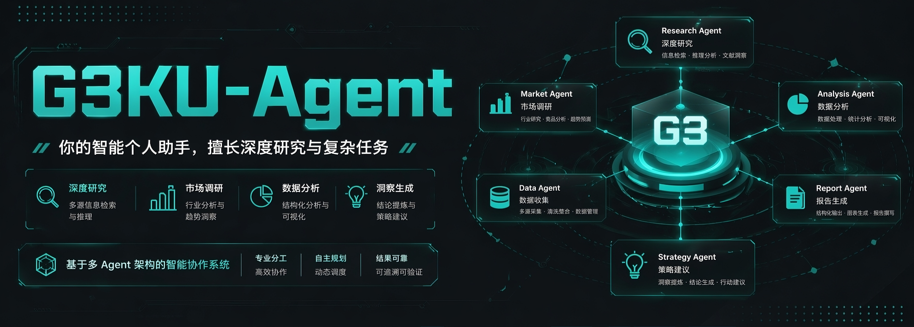
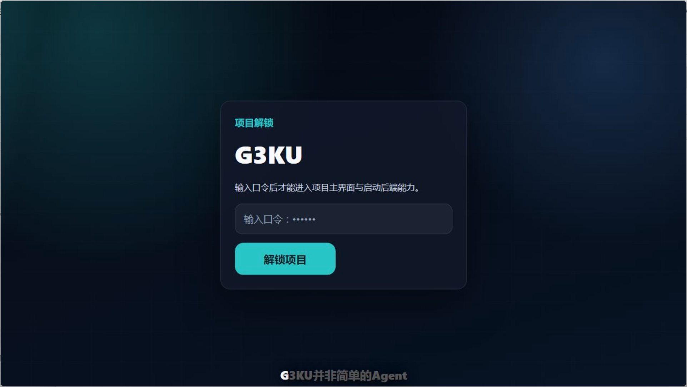

<p align="center">
  
</p>

# G3KU

目录：[项目介绍](#项目介绍) | [1. 配置环境](#1-配置环境) | [2. 启动项目](#2-启动项目) | [3. 配置模型](#3-配置模型) | [4. 通信配置（可选）](#4-通信配置可选) | [5. 功能介绍](#5-功能介绍) | [6. 面向开发者和-agent-的补充说明](#6-面向开发者和-agent-的补充说明) | [部署（Docker / Compose）](#部署docker--compose) | [7. 致谢与参考](#7-致谢与参考) | [8. 许可证](#8-许可证)

## 项目介绍

[](https://github.com/user-attachments/assets/e6ba8afb-d88e-44db-b049-122c86cdaad3)

**G3KU 是一套面向复杂工作流的Harness。一个能自主进化，长期运行、扩展能力、外部通信、同时支持 Web 管理界面的智能工作系统。**

它让 Agent 真正具备了可长期使用的能力：能记住重要信息、能按需调用工具、能拆解复杂任务、能在长会话里保持稳定、能在高并发下运行，也能在真实环境中把风险控制住。

这个项目的特点，可以从下面 7 个方面来理解：

1. 🧠 **自进化体系**
   系统会在受控边界内沉淀长期记忆、用户偏好和经验，不是每次都从零开始理解你。
2. 🧩  **渐进式加载模式**
   工具和技能不会一次性全部塞给模型，而是按需展示、按需加载，减少误用和上下文膨胀。
3. 👥  **多 Agent 架构**
   复杂任务可以拆成多个节点或子任务推进，而不是永远依赖单个 Agent 硬扛到底。
4. 🗺️  **混合 Agent 执行模式**
   系统既保留快速响应能力，也会在关键阶段做局部规划、分阶段推进和结果验收。
5. 🗜️  **多层上下文压缩优化机制**
   长任务里旧历史会逐层压缩，超长内容会外置成引用，避免上下文越跑越大。
6. ⚡  **性能监控与动态放行机制**
   当任务、工具和节点同时增多时，系统会自动限流和调速，高并发下保持整体稳定。
7. 🛡️  **安全机制**
   系统具备权限控制、人工审批、风险隔离和敏感信息保护，适合进入更真实的业务环境。


## 1. 配置环境

### 支持的系统环境

建议至少准备下面这些环境：

- Python `3.11` 或更高版本
- Windows PowerShell、Linux 或 macOS
- 现代浏览器，用于访问 Web 界面
- 如果你要启用通信渠道，再额外准备：
  - Node.js `>=20`
  - `pnpm` 或 `npm`

如果你只是先体验本地 Web 或 CLI，对话主流程只需要 Python 环境即可；只有在启用通信配置时，才需要 Node.js 相关依赖。

### 环境配置步骤

1. 克隆项目并进入仓库目录。

```bash
git clone <your-repo-url>
cd G3KU
```

2. 普通用户通常不需要手动创建虚拟环境。

推荐直接使用仓库提供的一键启动脚本。启动脚本会自动：

- 创建或复用本地 `.venv`
- 在缺少运行时依赖时自动安装项目依赖
- 自动生成缺失的基础配置
- 启动 Web，并在非 reload 模式下自动托管 worker

如果你只是正常使用项目，可以跳过下面的手动依赖安装步骤，直接看下一节“如何启动项目”。

3. 如果你是开发者，或你想手动控制环境，再按下面方式创建虚拟环境并安装依赖。

Windows PowerShell:

```powershell
python -m venv .venv
.venv\Scripts\Activate.ps1
python -m pip install --upgrade pip
pip install -e ".[dev]"
```

Linux / macOS:

```bash
python3 -m venv .venv
source .venv/bin/activate
python -m pip install --upgrade pip
pip install -e ".[dev]"
```

4. 如果你是开发者，且希望提前显式生成项目本地配置，也可以手动执行：

```bash
g3ku onboard --project
```

执行后，当前仓库下会生成项目自己的本地运行目录和配置文件，最重要的是：

- `.g3ku/config.json`

后续模型、Web、通信、运行时等配置都会围绕这个文件和前端配置页面展开。

## 2. 如何启动项目

### 默认启动方式：一键启动脚本 `start-g3ku`

对普通用户来说，推荐直接使用仓库根目录下的一键启动脚本。它会自动准备运行环境，并拉起你进入模型配置和通信配置最需要的 Web 界面。

Windows PowerShell:

```powershell
.\start-g3ku.ps1
```

Linux / macOS:

```bash
./start-g3ku.sh
```

如果你的系统第一次 clone 下来还没有执行权限，可以先运行：

```bash
chmod +x ./start-g3ku.sh
```

或者临时这样执行：

```bash
sh ./start-g3ku.sh
```

启动脚本默认会完成这些事情：

- 清理当前仓库下已经存在的 Web / worker 托管进程
- 检查端口占用
- 自动创建或复用 `.venv`
- 自动安装运行项目所需依赖
- 启动 Web
- 在非 reload 模式下自动让 Web 托管 worker

默认情况下，Web 会按项目配置启动。模板配置里的默认端口是 `18790`，通常可以直接在浏览器打开：

```text
http://127.0.0.1:18790
```

常用参数：

- Windows: `-BindHost`
  指定 Web 监听地址
- Windows: `-Port`
  指定 Web 端口
- Windows: `-OpenBrowser`
  启动后自动打开浏览器
- Windows: `-PromptLog`
  开启 prompt 日志
- Windows: `-Reload`
  开发时启用自动重载
- Windows: `-KeepWorker`
  Web 退出时保留托管 worker
- Linux / macOS: `--host`
  指定 Web 监听地址
- Linux / macOS: `--port`
  指定 Web 端口
- Linux / macOS: `--open-browser`
  启动后自动打开浏览器
- Linux / macOS: `--prompt-log`
  开启 prompt 日志
- Linux / macOS: `--reload`
  开发时启用自动重载
- Linux / macOS: `--keep-worker`
  Web 退出时保留托管 worker

快速示例：

Windows:

```powershell
.\start-g3ku.ps1 -OpenBrowser
.\start-g3ku.ps1 -BindHost 127.0.0.1 -Port 18790
.\start-g3ku.ps1 -Reload
```

Linux / macOS:

```bash
./start-g3ku.sh --open-browser
./start-g3ku.sh --host 127.0.0.1 --port 18790
./start-g3ku.sh --reload
```

## 3. 配置模型

模型配置推荐直接在前端完成，不需要先手动编辑大量 JSON 文件。

### 基本操作流程

1. 启动 Web 后，进入“模型配置”页面。
2. 先点击“新建配置”。
3. 新建好模型配置后，保存模型。
4. 点击右上角编辑模型链，再把左侧模型拖动到右侧对应 Agent 的模型链中。
5. 完成后点击“保存模型链”。

为了实现对话功能，至少需要先给主 Agent配置一个模型。但是为了确保所有功能正常运行，需要为：

- 执行Agent
- 检验Agent
- 记忆Agent

配置各自的模型链。

### 新建模型时怎么选供应商

如果模型支持 OpenAI 协议兼容接口，优先建议选择下面两类供应商之一：

- `Custom OpenAI-Compatible`
- `OpenAI Responses`

然后修改默认模板后保存。

### JSON 配置里要填什么

在模型详情页里，你会看到 JSON 配置区域。常见需要填写的字段包括：

- `api_key`
- `base_url`
- `default_model`

如果你的服务还需要额外头信息或参数，也可以继续补充在对应 JSON 中。

### 图片多模态怎么开

如果某个模型本身支持多模态识图，保存该模型后，打开它的详情页，可以勾选：

- `是否为图像多模态`

启用后，Agent 才会具备更完整的识图能力。没有开启时，系统不会把图片相关能力按多模态路线开放给该模型。

### RAG 模型是否必须配置

不是必须。

前端里有单独的 `RAG模型设置`，用于配置 Memory Runtime 当前使用的：

- Embedding
- Rerank

这部分属于增强项。你可以先只把主对话模型链跑通，再根据需要补充 RAG 相关模型。

如果安装的tool/skill过多（50+），再去配置 RAG 会更合适。

## 4. 通信配置（可选）

如果你希望不只在 Web 或本地 CLI 使用 G3KU，而是接入外部聊天渠道实现跨平台通信，可以使用前端的“通信配置”页面。

### 可以做什么

通信配置的作用是让 G3KU 接入不同平台，把平台消息送入统一 Agent Runtime，再把回复发回对应平台。

目前项目里支持的 canonical channel ids 包括：

- `qqbot`
- `dingtalk`
- `wecom`
- `wecom-app`
- `wecom-kf`
- `wechat-mp`
- `feishu-china`

对应到普通用户理解，可以看成支持这些方向的接入能力：

- QQ Bot
- 钉钉
- 企业微信
- 企业微信应用
- 企业微信客服
- 微信公众号
- 飞书

### 配置方式

1. 进入前端“通信配置”页面。
2. 在左侧选择你要接入的通信方式。
3. 右侧会显示该渠道的状态、启用开关和 JSON 配置区。
4. 可以先点击“加载模板”，再按渠道要求填写配置。
5. 保存后启用该通信方式。

前端会按渠道模板帮助你填写基础 JSON，例如不同平台要求的：

- `clientId`
- `clientSecret`
- `token`
- `encodingAESKey`
- `appId`
- `appSecret`
- `webhookPath`

具体字段会随着渠道类型不同而不同。

### 启用通信前需要注意什么

- 需要安装 Node.js `>=20`
- 需要准备 `pnpm` 或 `npm`
- 使用默认启动脚本或 Web 界面启动时，Web runtime 会管理 China bridge 的启停
- 如果你启用了渠道，但没有准备好 Node 环境或对应渠道参数，桥接不会正常工作

对普通用户来说，可以把它理解成：

**通信配置就是把 G3KU 从“本地可用”扩展到“能在外部平台和你聊天”。**

## 5. 功能介绍

如果你第一次接触 G3KU，下面这几类能力最容易快速上手：

1. **直接问 Agent“你能做什么？有哪些技能和工具？”**
   这是最快的入门方式之一。你可以直接让 Agent 列出当前可用的能力范围，快速了解它现在能处理哪些任务、能调用哪些技能、又有哪些工具可以配合使用。
2. **在 Skill 管理和 Tool 管理页面里自定义管理能力**
   你可以在前端页面里按需启用、停用、查看和调整 Skill 与 Tool，让系统能力更贴近自己的场景。对于支持热插拔的资源，更新后通常可以快速生效，不需要每次都重启整套系统。
3. **内置多种实用扩展能力**
   除了基础对话能力，系统还内置了浏览器自动化相关能力（包括 CDP / 页面操作类能力）、定时任务、联网访问，以及 Skill 安装与下载等扩展能力，方便把 Agent 从“会聊天”逐步扩展成“能做事”的工作系统。

### 如何新增 Skill 和 Tool

如果你想给当前项目新增能力，通常不需要先手动拷目录、改很多配置，最简单的方式就是**直接在会话里把 GitHub 地址、子目录地址、现成 `SKILL.md`，或者你的需求说明贴给 Agent**。

你可以直接这样说：

- `把这个 GitHub skill 接入当前项目：<url>`
- `参考这个仓库，给项目新增一个用于 XXX 的 tool：<url>`
- `帮我做一个 skill，用来规范 XXX 工作流`
- `把这个 CLI / API / 脚本封装成 G3KU tool，要求支持 XXX`

一般情况下，Agent 会按资源类型自动处理：

- `skill`
  优先导入或创建到 `skills/`
- `tool`
  优先在 `tools/` 下注册；如果是第三方项目，通常会按项目约定接入到 `externaltools/`

为了让 Agent 一次做对，建议你顺手补充这些信息：

- 这个能力是给谁用的
- 想解决什么问题
- 输入和输出大概是什么
- 依赖哪个仓库、脚本、CLI 或 API
- 是否需要额外环境变量、密钥或系统依赖

如果你只是想快速开始，很多时候一句话加一个地址就够了，例如：

```text
把这个 GitHub skill 接入当前 G3KU：<url>
```

```text
参考这个项目，帮我新增一个 G3KU tool：<url>
```

完成后，你还可以在前端的 Skill 管理和 Tool 管理页面里继续查看、启用、停用或微调这些能力。

## 6. 面向开发者和 Agent 的补充说明

这一节主要给二次开发者、维护者，以及接手本仓库的 Agent 使用。

### 项目文档位置

如果你只是普通用户，可以先忽略这一节；如果你要改代码、排查问题或让 Agent 接手仓库，建议优先看这些文档：

- `docs/architecture/README.md`
  架构入口和阅读顺序
- `docs/architecture/runtime-overview.md`
  主运行时、frontdoor、任务运行时关系
- `docs/architecture/web-and-admin.md`
  Web、管理页、前后端边界
- `docs/architecture/config-and-models.md`
  配置入口、模型系统、运行时刷新
- `docs/architecture/china-channels.md`
  通信桥接与 Python / Node 边界
- `docs/architecture/operations-and-maintenance.md`
  运维、排障和启动建议
- `docs/analysis/2026-04-21-g3ku-six-pillars-user-introduction.md`
  面向用户和业务视角的七大能力支柱介绍

### 给 Agent 的建议阅读顺序

如果是仓库内 Agent 接手任务，建议按下面顺序建立上下文：

1. 先看 `AGENTS.md`
2. 再看 `docs/architecture/README.md`
3. 然后按任务涉及范围继续读对应架构文档

### 其他专业启动方式

除了默认的一键启动脚本，这个项目也支持几种更偏开发、验证和排障的手动启动路径。

### 手动环境准备

如果你想完全手动地理解启动链路，可以先自己准备虚拟环境：

Windows PowerShell:

```powershell
python -m venv .venv
.venv\Scripts\Activate.ps1
python -m pip install --upgrade pip
pip install -e ".[dev]"
```

Linux / macOS:

```bash
python3 -m venv .venv
source .venv/bin/activate
python -m pip install --upgrade pip
pip install -e ".[dev]"
```

如果你还想提前生成本地配置：

```bash
g3ku onboard --project
```

### 手动启动与排障方式

- CLI 对话：

```bash
g3ku agent
```

- CLI 单条消息测试：

```bash
g3ku agent -m "你好，介绍一下你自己"
```

- 手动启动 Web：

```bash
g3ku web
```

- 手动启动 Web 并指定地址端口：

```bash
g3ku web --host 127.0.0.1 --port 18790
```

- 如果你启用了 `--reload`，通常还需要单独启动 worker：

```bash
g3ku worker
```

- 后台任务 Worker：

```bash
g3ku worker
```

- 状态检查：

```bash
g3ku status
```

- 通信子系统排障：

```bash
g3ku china-bridge doctor
```

### 对开发者的简单理解

从工程结构上看：

- `g3ku/` 是主应用代码，包含 CLI、Web、运行时、配置和桥接
- `main/` 是异步任务和节点执行主线
- `subsystems/china_channels_host/` 是通信桥接用的 Node 宿主
- `memory/` 是长期记忆相关数据目录

也就是说，G3KU 不只是一个前端页面加一个聊天后端，而是一整套可以长期运行、可扩展、可运维的 Agent 基础设施。

## 部署（Docker / Compose）

如果你希望把 G3KU 作为长期运行的服务部署，而不是只在本机直接启动，可以使用仓库内置的 Docker / Compose 部署方式。

### 如何启动

1. 复制 `.env.docker.example` 为 `.env`
2. 在仓库根目录执行：

```bash
docker compose up --build
```

### 服务分工

- `compose.yaml` 会启动两个核心服务：`web` 和 `worker`
- `web` 负责 Web 界面、API、heartbeat、cron，以及 China bridge supervisor
- `worker` 只负责 detached task worker，也就是后台异步任务执行

这种拆分方式的重点不是把功能切碎，而是让 Web 入口和后台任务执行各自独立运行，同时共享同一份项目状态与资源目录。

### 必须持久化的目录

如果你希望容器重启后，会话、任务、模型配置、skills、tools 和任务临时文件继续保留，下面这些目录必须一起挂载到持久化卷：

- `.g3ku/`
- `memory/`
- `sessions/`
- `temp/`
- `skills/`
- `tools/`
- `externaltools/`

这组目录共同覆盖了项目配置、模型绑定和密钥状态、会话历史、任务运行时数据、长期记忆、任务临时文件、可变技能资源、工具资源以及第三方工具载荷。只保留其中一部分通常是不够的；如果缺少其中任意关键目录，系统虽然可能还能启动，但重启后会出现状态丢失。

### 适用场景

- Docker 部署是新增的部署路径，不会替代 `start-g3ku.ps1` 和 `start-g3ku.sh`
- 本地开发、调试和单机直接运行，仍然推荐继续使用现有启动脚本
- Docker / Compose 更适合长期运行、进程隔离和统一管理

如果你在 Docker 部署后发现 Web 正常，但 worker 重启后丢失模型、会话或任务状态，优先检查这些目录是否都已经正确持久化，而不是先怀疑业务逻辑本身。

## 7. 致谢与参考

G3KU 在设计和迭代过程中，参考了部分优秀开源项目的工程实践与产品思路。在此对相关项目与作者表示感谢。

- [OpenClaw](https://github.com/openclaw/openclaw.git)
  为 G3KU 的整体项目开发方向和 Agent 工程化实践产生了启发。
- [openclaw-china](https://github.com/BytePioneer-AI/openclaw-china.git)
  `subsystems/china_channels_host` 中的中国渠道运行时整合了该项目的上游运行时代码，并在 G3KU 中通过桥接与包装层接入。
- [Hermes Agent](https://github.com/NousResearch/hermes-agent.git)
  为 G3KU 的自主维护记忆、长期记忆沉淀与持续协作能力提供了灵感。
- [oh-my-openagent](https://github.com/code-yeongyu/oh-my-openagent.git)
  为 G3KU 的多 Agent 编排、任务拆解与协同推进提供了启发。
- [OpenViking](https://github.com/volcengine/OpenViking.git)
  为 G3KU 的分层渐进式加载、能力暴露控制与上下文组织方式提供了灵感。

说明：G3KU 为结合自身目标、运行时设计与使用场景的独立项目；其中 `subsystems/china_channels_host` 包含已整合并适配的 `openclaw-china` 上游运行时代码。第三方来源与许可说明见 [THIRD_PARTY_NOTICES.md](THIRD_PARTY_NOTICES.md) 和 [subsystems/china_channels_host/UPSTREAM.md](subsystems/china_channels_host/UPSTREAM.md)。

## 8. 许可证

本项目整体采用 MIT 许可证，详见 [LICENSE](LICENSE)。仓库内整合的第三方代码来源与说明见 [THIRD_PARTY_NOTICES.md](THIRD_PARTY_NOTICES.md)。
