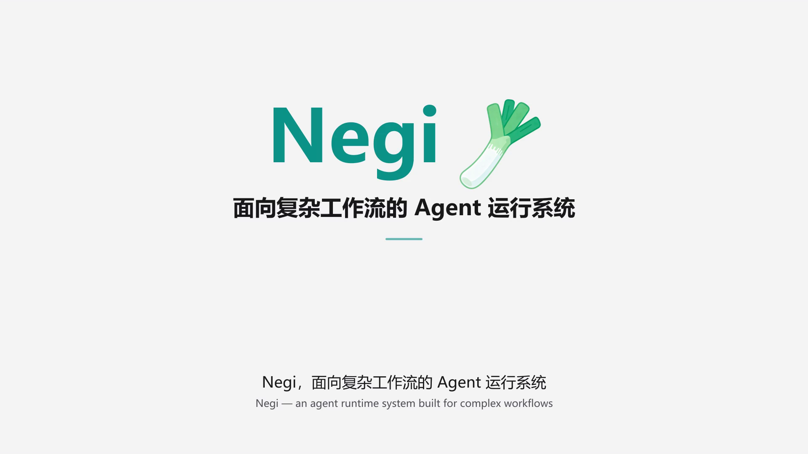

<p align="center">
  
</p>

# Negi

目录：[1. 概览](#1-概览) | [2. 快速开始](#2-快速开始) | [3. Web 界面](#3-web-界面) | [4. 能力扩展](#4-能力扩展) | [5. 模型配置](#5-模型配置) | [6. 外部接入](#6-外部接入) | [7. 运行行为](#7-运行行为) | [8. 安全与权限](#8-安全与权限) | [9. 升级与版本检查](#9-升级与版本检查) | [10. 部署](#10-部署) | [11. 手动安装与命令行](#11-手动安装与命令行) | [12. 开发者指南](#12-开发者指南) | [13. 致谢](#13-致谢) | [14. 许可证](#14-许可证)

[](https://github.com/user-attachments/assets/e6ba8afb-d88e-44db-b049-122c86cdaad3)

## 1. 概览

### 为什么需要 Negi？

使用多个 AI 模型时，你可能面临这些问题：

- 💸 **模型成本不均**　某个模型便宜但容量有限，需要在不同模型间频繁手动切换；或某个模型限流，只能等待或降级。
- 🔄 **手动切模型很烦**　API 返回"限流"或"超时"时，没有自动备选方案，只能停下来调整配置。
- 😵 **长任务容易断**　需要处理的工作量大，一个请求超时或某个环节出错，整个任务得从头再来。
- 📊 **结果难以验证**　AI 的输出能否用、是否完整、下一步该做什么，这些都需要人工逐一检查。
- 🎯 **并发没有上界**　同时跑太多请求会打爆 API，跑太少则浪费时间；没有动态平衡的机制。

**Negi 解决的是这些问题**。它自动在多个模型间切换与平衡，当一个模型不可用时无缝转向备选项；同时提供任务拆解、进度验证与自动恢复，让你用 AI 处理长期的、复杂的工作流，而不是一次性的问答。

### 1.1 核心能力（已实装）

| 能力 | 作用 |
| --- | --- |
| **模型链负载均衡与容灾** | 配置多个模型，系统自动按角色分配、监测限流并无缝转移，无需手动切换 |
| **任务拆分与结果验证** | 复杂工作拆成多个执行节点，自动验证每个环节的产出，不符合要求时自动补正 |
| **长期记忆** | 重要信息跨会话沉淀，避免每次从零开始 |
| **自适应并发** | 根据本机压力、上游限流、磁盘空间等动态调整并发数，既高效又稳定 |
| **上下文管理** | 支持超长历史，自动压缩过期内容，保持请求前缀稳定以复用 API 缓存 |
| **Web 管理界面** | 浏览器中创建会话、派发任务、管理配置，无需命令行 |
| **权限与审批** | 工具调用可设置人工审批，关键字段加密存储 |
| **多渠道接入** | 支持 Web 浏览器、聊天平台（QQ）、标准 OpenAI 兼容接口、MCP 工具网关 |

### 1.2 系统组成

| 组成 | 职责 |
| --- | --- |
| Web 服务 | 管理界面、会话对话、心跳与定时任务、对外接口 |
| 任务执行进程 | 后台任务的执行与结果检验；默认由 Web 服务托管并随之启停 |
| 资源目录 | `skills/`、`tools/`、`externaltools/`，存放可插拔的技能与工具 |
| 数据目录 | `.g3ku/` 存放配置、密钥、日志与会话数据；`memory/`、`sessions/`、`temp/` 存放运行数据 |

### 1.3 与常见对话助手的差异

常见助手只需要处理"一次提问、一次回答"。Negi 面向长时间连续工作的场景，因此额外实现了以下部分，它们都是已提供功能而非规划：

- **模型池与自动转移**：一组备用模型按顺序接替，限流或连接中断时无需人工干预自动改用其他可用配置。
- **任务拆分与结果检验**：阶段推进由模型提交，检验节点依据实际产出判定，未通过时返回待补事项清单。
- **上下文长度控制**：只在两处收敛历史（回合内压缩、阶段结束压缩），其余内容保持追加，使上游服务的请求前缀缓存能够持续命中。
- **并发自适应**：同时执行的回合数由本机压力（事件循环延迟、写入队列、上游限流、内存余量、磁盘空间）实时决定。
- **优雅停止与恢复**：退出前排空正在执行的回合；重启后逐项判断此前任务是否已经产生实际影响，再决定继续、重做或交回模型判断。
- **多渠道接入**：既能接入聊天平台，也能作为标准接口供其他程序调用或被工具网关暴露。

## 2. 快速开始

### 2.1 环境要求

- Python 3.11 或更高版本（一行命令安装按仓库的 `.python-version` 准备解释器，当前为 3.12）
- Windows PowerShell、Linux 或 macOS
- 现代浏览器

对话与任务功能只需要 Python 环境。接入 QQ 官方机器人无需额外安装依赖，相关程序库已包含在项目依赖中；接入其他聊天平台由独立的桥接程序完成，见 [6. 外部接入](#6-外部接入)。

### 2.2 一行命令安装

新设备上执行一条命令即可完成安装并启动：脚本自行安装 uv、准备 Python、获取代码、按锁文件建立环境，最后启动 Web 服务。

Windows PowerShell：

```powershell
iwr https://raw.githubusercontent.com/ZXY39/G3KU-Agent/v1.0.15/install.ps1 | iex
```

Linux / macOS：

```bash
curl -LsSf https://raw.githubusercontent.com/ZXY39/G3KU-Agent/v1.0.15/install.sh | bash
```

默认安装到 `~/G3KU-Agent`，无需预先安装 Python。设备上缺少 git 时改用源码包下载（需要 curl 或 wget，以及 unzip）。

无法解析 `raw.githubusercontent.com` 时，可改用镜像通道获取同一脚本，仓库地址与参数不变：

```powershell
iwr https://cdn.jsdelivr.net/gh/ZXY39/G3KU-Agent@v1.0.15/install.ps1 | iex
iwr https://ghfast.top/https://raw.githubusercontent.com/ZXY39/G3KU-Agent/v1.0.15/install.ps1 | iex
```

发布页同时提供同一份脚本，可绕开 raw 域名：`https://github.com/ZXY39/G3KU-Agent/releases/download/v1.0.15/install.ps1`。使用第三方代理相当于把"执行什么代码"交给该代理，稳妥做法是先下载再检查：脚本首行应为 `#requires -Version 5.1` 或 `#!/usr/bin/env bash`，脚本内固定的版本号应与地址中的版本标签一致，文件字节数以发布页列出的大小为准。

网络访问 PyPI 或 Python 发行包较慢时，为 uv 指定镜像地址即可，脚本不另设开关：

```bash
export UV_DEFAULT_INDEX=https://pypi.tuna.tsinghua.edu.cn/simple
export UV_PYTHON_INSTALL_MIRROR=<可用的 python-build-standalone 镜像>
```

### 2.3 首次启动与项目口令

安装流程的终点是项目口令设置页。首次启动会在浏览器中要求创建项目口令，设置完成后才进入配置页面；口令用于保护配置中的密钥，遗失后无法恢复。

安装得到的文件集合与仓库纳入版本管理的文件一致：项目自带的技能与工具在其中，本机通过市场安装的技能、`externaltools/` 目录与 `.g3ku/` 数据不在其中，需要在新设备上按需重新添加。

### 2.4 配置第一个模型

1. 打开 Web 界面，进入「模型」页面。
2. 点击「添加模型」，填写名称、接口地址与密钥，保存。
3. 点击右上角的编辑入口进入模型顺序编辑界面，把左侧已保存的模型拖入右侧对应角色的列表。
4. 点击「保存模型链」。

至少需要为主对话角色配置一个模型。为使全部功能正常运行，执行、检验、记忆三个角色都应各自配置一组模型，说明见 [5. 模型配置](#5-模型配置)。

### 2.5 脚本参数

安装脚本：

| 参数 | 作用 |
| --- | --- |
| `-Dir PATH` / `--dir PATH` | 指定安装目录 |
| `-NoStart` / `--no-start` | 只准备环境，不启动服务 |
| `-Ref TAG` / `--ref TAG` | 指定安装版本，用于回滚或试装 |
| `-Upgrade` / `--upgrade` | 将已安装的设备更新到指定版本 |

启动脚本 `start-g3ku`：

| Windows | Linux / macOS | 作用 |
| --- | --- | --- |
| `-BindHost` | `--host` | 指定监听地址 |
| `-Port` | `--port` | 指定端口 |
| `-OpenBrowser` | `--open-browser` | 启动后打开浏览器 |
| `-PromptLog` | `--prompt-log` | 记录提示词日志 |
| `-Reload` | `--reload` | 开发用自动重载 |
| `-KeepWorker` | `--keep-worker` | 退出时保留托管的执行进程 |

## 3. Web 界面

### 3.1 导航结构

侧栏提供 8 个页面，「设置」位于侧栏底部：

| 页面 | 内容 |
| --- | --- |
| 会话 | 与主对话交流、查看阶段进展与工具调用、提交排队待发的补充内容 |
| 任务 | 任务节点树、消息分发状态、检验结果与退回记录、性能读数 |
| Skill | 技能列表、启用状态、来源与版本 |
| Tool | 工具与工具族的启用状态、角色可见范围、执行审批设置 |
| 记忆 | 待写入的长期记忆条目、审阅与批量应用队列 |
| 模型 | 模型记录、接口协议、各角色的模型顺序 |
| 外部 | 聊天平台接入与桥接凭证管理 |
| 日志 | 审计事件与运行日志，存在未读时显示标记 |

侧栏底部的「设置」中是版本信息、「检查更新」与「重启并更新」。

### 3.2 常用操作

- **询问当前可用能力**：直接向对话提出"你现在可以使用哪些工具和技能"，系统按当前实际可见范围回答。
- **派发后台任务**：说明目标与验收标准即可，任务在任务页展开为节点树。
- **编辑与分支**：会话中的消息支持编辑后重新发送，也支持从某条消息处开启新的会话分支。
- **语音输入**：输入区的麦克风按钮默认显示，说明见 [7.5 语音输入](#75-语音输入)。
- **手动收敛历史**：在输入区的上下文指示控件上按住不放，进度走满后触发一次历史压缩；压缩进行期间新到的消息排队等待，不会丢失。

## 4. 能力扩展

### 4.1 已随仓库提供的能力

| 类别 | 数量与内容 |
| --- | --- |
| 文件操作 | 7 个工具：写入、编辑、复制、移动、删除、查看属性、提交修改建议 |
| 命令执行 | 1 个工具，受审批与白名单约束 |
| 网络访问 | 1 个抓取工具，不启动浏览器 |
| 外置结果回读 | 4 个工具：列出、按名查找、打开、描述已保存的超长结果 |
| 长期记忆 | 4 个工具：写入、批注、删除、运行时设置 |
| 任务与性能 | 11 个工具：创建任务、管理节点、追加说明、查询进度与统计、查看节点详情、查看失败节点、删除任务、性能读数 |
| 按需加载 | 3 个工具：加载技能说明、加载工具说明、安装技能 |
| 定时任务 | 1 个工具 |
| 模型配置 | 1 个工具 |

另有若干由系统自身使用的提交类工具（阶段推进、结论交付、派生子节点、静默、消息分发），它们不出现在资源目录中。

技能方面随仓库提供 15 个，覆盖架构文档维护、桥接接入、技能与工具的创建与修复、检索、代码仓库操作、终端会话、任务复盘等。其他技能可由市场安装。

页面操作能力由自带的 `web-access` 技能提供，通过 Chrome 的调试接口连接本机正在使用的浏览器，因此能沿用已有的登录状态。它不是内置工具，需要使用者在本机浏览器中开启远程调试并安装 Node.js 22 或更高版本。

### 4.2 按需加载的作用

工具与技能数量增加后，把全部说明一次性提供给模型会挤占上下文并提高误用概率。系统的处理方式是：每一轮先给出名称清单，模型判断需要哪一个，再取该条目的完整说明与参数定义，下一轮才允许调用。因此界面上"能看到名称"与"能实际调用"是两个不同状态，排查工具不可用时应先确认它处于哪一步。

### 4.3 新增技能或工具

无需手工创建目录或修改配置文件，在会话中直接提交下列形式的说明即可：

```text
把这个仓库中的技能接入当前项目：<地址>
参考这个仓库，为项目新增一个用于 <用途> 的工具：<地址>
创建一个技能，用于规范 <流程>
把这个命令行工具 / 接口 / 脚本封装为工具，要求支持 <参数>
```

系统按目标类型处理：技能写入 `skills/`，工具注册到 `tools/`，第三方项目通常接入 `externaltools/`。为提高一次成功的把握，建议同时说明用途、使用者、输入输出形式、依赖的仓库或脚本、是否需要额外的环境变量与系统依赖。完成后仍可在 Skill 与 Tool 页面查看、启用或停用。

### 4.4 资源热更新

资源目录的变更由后台轮询发现并生效，默认开启。修改一个技能说明或工具清单通常在分钟级内反映到运行时，无需重启整套系统；已停用的条目不会被加载。

## 5. 模型配置

### 5.1 角色与调用顺序

系统按职责区分四个角色：主对话、执行、检验、记忆。每个角色配置一组模型，**排列顺序即接替顺序**：只有排在前的模型调用失败，请求才会交给下一个。因此这组配置的作用是提高可用性，而不是随机选择。

### 5.2 分组与分摊

执行与检验两个角色允许把多个模型归为一组使用：组内成员地位相同，由并发控制层为每个节点指定实际使用的成员，从而分摊请求量。主对话与记忆角色不支持这种用法——前者需要在一个会话内保持模型稳定以复用请求前缀缓存，后者有固定的单并发要求。

### 5.3 在会话中指定模型

输入区的上下文面板可以把某个会话固定到指定模型。被固定的模型被删除或停用时，系统自动回到该角色的模型顺序列表，不会带着不可用的模型继续请求。

### 5.4 接口协议

当前支持两种 OpenAI 兼容协议：

- `OpenAI Chat`（`/chat/completions`）
- `OpenAI Responses`（`/responses`）

协议由所选模板决定，切换协议相当于更换模板，同时决定可填写的参数集合；切换时已填写的地址与密钥等内容保留。请求地址填写根地址或完整端点均可，系统自动归一。

`OpenAI Responses` 的请求体只包含各家实现共同支持的字段，扩展字段（例如输出文本控制项、独立的系统指令字段）会被部分服务整体拒绝。保存模型时系统会发起一次真实形态的探测请求，字段级不兼容在保存阶段就会暴露并附带对方返回的原文；遇到此类拒绝改用 `OpenAI Chat` 即可。

### 5.5 图像理解

模型本身支持识图时，在其详情页勾选「是否为图像多模态」。未勾选时，系统不会把图片按多模态方式提供给该模型。

### 5.6 模型记录中需要填写的内容

模型详情页的 JSON 区域常见字段：

- `api_key`：密钥
- `base_url`：接口地址
- `default_model`：默认模型名

需要额外的请求头或参数时，可以继续补充在同一份 JSON 中。

### 5.7 长期记忆不需要额外模型

长期记忆由独立的记忆处理流程维护：写入通过记忆相关工具提交，保存前经过校验与批量应用，队列与审阅界面在「记忆」页面。记忆角色按普通角色配置一组模型即可。

超长内容的处理与回读由上下文机制完成（见 [7.2 上下文长度控制](#72-上下文长度控制)）。

### 5.8 配置生效时机

保存配置会直接作用到正在运行的服务，无需重启。生效位置是请求边界：已经开始的一次模型请求不会被中途更换模型，新的顺序在下一次请求处使用。

## 6. 外部接入

系统提供三种接入方式，按需选择其一或组合使用。

```
① 聊天平台 ⇄ 内置 QQ 官方适配器（与服务同进程，在「外部」页面配置）
② 聊天平台 ⇄ 独立桥接程序（其他平台协议） ⇄ 对外接口 /api/v1
③ 其他程序 ⇄ 标准兼容接口、工具网关 ⇄ 同一套对外接口
```

判定原则：**换一个聊天平台就需要修改的代码，不放在核心内**。平台协议、消息分段、频率限制、触发词识别一律属于桥接层。

### 6.1 内置 QQ 官方适配器

`g3ku/qq_official/` 是唯一内置的平台适配器，以桥接程序的身份使用本系统的对外接口，QQ 协议只出现在该模块内。

- **配置**：「外部」页面的 QQ 官方机器人面板按账号列行。配置文件中的段落为 `qqBot`，包含总开关 `enabled` 与 `accounts`（以 AppID 为键，每项含 `appSecret`、`sandbox`、`enabled`、`label`）。默认为关闭状态，需要显式启用。
- **多账号**：一个账号对应一个 AppID、一条桥接身份、一份独立的会话范围与凭证，账号之间不共享任何句柄；面板按账号分别显示运行状态，单个账号异常不影响其他账号建立连接。
- **支持内容**：图片与文件的收发、收到的语音在本机转写、主动提醒（心跳、定时任务、任务结束通知）。
- **平台限制**：主动消息受 QQ 开放平台的额度与回复时间窗约束，因此**由网页发起的会话回复同样受此限制**；平台拒投时的表现是网页有完整回复而聊天端没有收到。新增账号后原有会话标识不迁移，指向旧会话的定时任务与提醒目标需要改指新会话。

### 6.2 其他聊天平台：独立桥接程序

核心只暴露一套与平台无关的接口，桥接程序作为独立进程运行，可自行实现或采用第三方项目：

- 把平台消息提交为系统内的会话回合，订阅流式事件（增量、里程碑、最终回复），再把回复发回平台；
- 心跳提醒、定时任务、任务结束等主动推送通过统一的事件送达桥接，桥接确认送达后系统才记为完成；
- 每个桥接程序使用独立的标识与凭证，会话范围彼此隔离，可以多个桥接同时运行。

启用与凭证发放：

```json
{
  "externalApi": {
    "enabled": true,
    "tokens": {
      "my-bridge": { "token": "<随机长串>", "label": "我的桥", "enabled": true }
    }
  }
}
```

凭证以明文提交保存时会自动移入加密存储，配置文件中只留占位（与模型密钥同一机制）。桥接程序指向本系统的服务地址并携带 `Authorization: Bearer <token>`。

仓库提供一份参考实现：`bridges/qq-onebot/`（QQ / OneBot 11，例如 NapCat），配置与运行方式见其 `README.md`。

### 6.3 作为服务供其他程序调用

在上述接口之上另有两个可直接使用的对接形式，二者都随 `externalApi.enabled` 一并开启：

- **OpenAI 兼容接口** `POST /api/v1/chat/completions`：供任何按 OpenAI 协议调用的客户端使用，包含会话映射、等待与超时、流式返回。
- **工具网关** `g3ku mcp serve`：把系统能力以标准工具协议暴露给本机其他程序；`g3ku mcp check` 用于自检。

## 7. 运行行为

### 7.1 任务分解、阶段推进与结果检验

后台任务以节点树形式组织，父子层级有深度上限。每个执行节点按阶段推进：模型在一个阶段内完成工作后提交阶段结论，系统据此开启下一阶段。任务设有检验节点，检验不通过时返回的说明包含目标、已完成部分与待补事项，执行节点据此继续工作。

节点支持单独暂停、恢复与终止。父节点暂停会连带其子树，恢复时按层级逐个放行；同一批消息的分发设有确认环节，未全部送达不会宣告完成。

### 7.2 上下文长度控制

历史内容只在两个位置收敛：

- **回合内压缩**：一次对话即将超出模型窗口时，较早的历史被替换为摘要。
- **阶段结束压缩**：某个阶段完结后，其过程内容退出上下文，保留结论。

除此之外历史保持追加，因此请求的前部内容稳定，上游服务的自动前缀缓存能够持续命中。超长工具结果不进入历史，而是写入文件并给出引用，模型需要时通过回读工具查看。输入区的上下文面板显示当前用量与所用模型。

### 7.3 并发控制与故障转移

同时执行的模型回合数量由系统实时调整，参考的因素包括本机事件循环延迟、写入队列长度、数据库读写压力、内存余量、上游限流情况与磁盘空间。上游限流或连接中断时，请求会改用备用模型或其他可用配置，而不是在同一位置反复重试。任务页的性能读数与「性能查看」工具读取的是同一组实时数据。

磁盘空间不足是唯一能把同时执行数量直接降为零的情况，其余因素只逐级收紧。

### 7.4 停止与重启后的恢复

正常退出时，系统先在有限时间内排空正在执行的回合，再停止服务。仍处于暂停状态的任务在重启后逐项判断：根据记录确认这一轮此前是否已经产生实际影响（例如已经写文件、已经发消息），再决定继续执行、重新执行，还是交回模型判断。无法确认时按"已有影响"处理，避免重复动作。

### 7.5 语音输入

语音转写在**本机**完成，音频不上传到任何外部服务。使用 whisper.cpp 官方程序与开源模型，转写能力默认允许使用，但不会因为默认值而自动下载任何文件：首次点击麦克风时才拉取程序与模型，合计约 157 MB（程序 15 MB、`base` 模型 142 MB）。也可以先用命令行准备：`g3ku stt prepare`。

转写结果作为该条消息的正文进入对话，并保留来源标记；转写失败的条目会明确标注失败原因。聊天平台收到的语音同样在本机转写，转写结果之外还保留原始音频供回放。未准备好模型时，语音退回普通文件处理，不会静默丢弃。

## 8. 安全与权限

- **口令与密钥存储**：首次启动设置的项目口令用于派生主密钥。模型密钥、桥接凭证、平台密钥等在提交保存时即从明文配置中移出，进入加密存储，只在解锁后回填使用；未解锁时相关写接口返回锁定状态。配置支持打包导出与导入。
- **角色可见范围**：工具与技能按主对话、执行、检验三种角色分别设置可见范围，在 Tool 与 Skill 页面编辑。清空某条目的全部角色即对其不可见、不可调用，不存在"默认全部放行"的兜底。
- **命令执行审批**：命令类操作可按设置要求人工批准，批准结果分为本次允许、加入白名单、拒绝三种；等待时长可调。监管模式下批量动作先进入审阅界面再执行。
- **危险操作确认**：删除类操作要求先给出预览、再确认执行；文件修改可以以建议形式提交后统一采纳。
- **数据不出本机**：语音转写在本机完成；版本检查只读取远端版本标签列表，不外发任何本地信息。
- **磁盘保护**：磁盘空间低于阈值时并发控制直接收拢，防止产生半完成的数据。

## 9. 升级与版本检查

默认安装位置：Windows `%USERPROFILE%\G3KU-Agent`，Linux / macOS `~/G3KU-Agent`。环境目录 `.venv/` 与数据目录 `.g3ku/` 都在该目录内，升级不会改动它们。

- **查看是否有新版本**：在项目目录执行 `g3ku status`，输出的最后一行 `Release:` 显示当前版本与远端最新标签。离线、缺少 git 或远端不是本仓库时该行不出现，不会给出"已是最新"的错误结论。
- **自动检查**：服务运行期间每 5 小时检查一次，启动时同样检查一次。开关与间隔在配置文件的 `update_check`（`enabled` / `interval_hours`）。项目处于锁定状态时不检查也不提醒。
- **有新版本时**：侧栏「设置」按钮左上角出现标记，命令行启动时也会提示一行。设置页显示「当前版本 · 最新标签 · 检查于」，可手动检查，也可点击「重启并更新」——该操作会先暂停正在进行的对话与任务，更新完成后自动重启服务。代码不会被自动替换，必须由使用者确认。
- **手动升级**：`.\install.ps1 -Upgrade`（Linux / macOS `./install.sh --upgrade`）。默认升级到脚本内固定的版本，指定版本加 `-Ref v1.0.15` / `--ref v1.0.15`。
- **改动过仓库自带文件时**，`-Upgrade` 拒绝执行，需要先提交或丢弃这些改动；自行安装的技能、桥接产物等未纳入版本管理的文件不计入。
- **更新过程可追溯**：「重启并更新」的完整过程写入 `.g3ku/logs/update-apply.log`，安装脚本的进度实时续写；超过 30 秒没有新输出时另记一行"仍在运行"，慢网络下可以区分等待与卡死。不会出现空白的命令行窗口。
- **已知限制**：以源码包方式安装的设备，升级只覆盖新版本带来的文件，上一版中被删除的文件不会被回收。需要完整一致的文件集合时，请使用 git 安装，或删除目录重装。

## 10. 部署

如果希望作为长期运行的服务部署，可使用仓库内置的 Docker / Compose 方式。

### 10.1 启动步骤

1. 复制 `.env.docker.example` 为 `.env`。
2. 处理 `G3KU_BOOTSTRAP_PASSWORD`：它用于容器启动时自动解锁**已经初始化过**的项目（另有 `G3KU_BOOTSTRAP_MASTER_KEY` 可直接提供主密钥）。首次安装仍然需要在浏览器中创建项目口令，该环境变量不会代为设置。示例值 `change-me` 会以明文出现在容器环境中，共享主机上部署前应替换。
3. 在仓库根目录执行：

```bash
docker compose up --build
```

镜像基于 `python:3.11-slim`，以 `uv sync --frozen --no-dev` 安装依赖；`skills/` 与 `tools/` 会作为初始内容写入镜像，首次启动时补入数据卷。

### 10.2 服务分工

- `web` 负责管理界面、接口、心跳、定时任务与对外接入接口。
- `worker` 只负责后台任务的执行。

两个服务共享同一份项目状态与资源目录，分开的目的不是拆分功能，而是让界面入口与任务执行互不影响。

### 10.3 必须持久化的目录

会话、任务、模型配置、技能、工具与临时文件要在容器重启后继续保留，必须为以下目录挂载持久卷：

```
.g3ku/  memory/  sessions/  temp/  skills/  tools/  externaltools/
```

这些目录共同覆盖配置与密钥状态、会话历史、任务运行数据、长期记忆、任务临时文件、可变技能与工具资源。只保留其中一部分通常不足够：系统仍可能启动，但重启后会丢失状态。

### 10.4 适用场景

- 容器方式适用于长期运行、进程隔离与统一管理；本地开发、调试与单机直接运行仍建议使用启动脚本。
- 依赖本机环境的扩展（浏览器页面操作、输入区麦克风）在容器中缺少对应的宿主设备与浏览器，仍按本机方式使用。
- 若 Web 正常而任务状态在 worker 重启后丢失，先核对上述目录的挂载，再检查业务逻辑。

## 11. 手动安装与命令行

本节面向需要完全控制环境的开发者，以及排障时需要单独启动某一环节的场合。

### 11.1 手动准备环境

```bash
git clone <仓库地址>
cd G3KU-Agent
```

```powershell
# Windows PowerShell
uv sync --frozen --extra dev
# 或使用 pip
python -m venv .venv
.venv\Scripts\Activate.ps1
python -m pip install --upgrade pip
pip install -e ".[dev]"
```

```bash
# Linux / macOS
uv sync --frozen --extra dev
# 或使用 pip
python3 -m venv .venv
source .venv/bin/activate
python -m pip install --upgrade pip
pip install -e ".[dev]"
```

需要提前生成项目本地配置：

```bash
g3ku onboard --project
```

执行后在当前仓库生成 `.g3ku/config.json`，模型、界面、接入与运行时的配置均围绕该文件展开。

### 11.2 启动方式

```bash
g3ku web                              # 启动 Web 服务（默认托管任务执行进程）
g3ku web --host 127.0.0.1 --port 18790
g3ku web --reload                     # 开发用自动重载（此时不再托管执行进程）
g3ku worker                           # 单独启动后台任务执行进程
g3ku agent                            # 命令行对话
g3ku agent -m "你好，介绍一下你自己"   # 单条消息测试
g3ku status                           # 运行状态与版本信息
```

默认端口为 18790，浏览器访问 `http://127.0.0.1:18790`。使用 `--reload` 时任务执行进程需要单独启动，其余情况由 Web 服务托管并随之启停。

### 11.3 命令一览

| 命令 | 用途 |
| --- | --- |
| `g3ku onboard` | 生成配置与工作目录 |
| `g3ku web` / `g3ku worker` / `g3ku agent` | 启动服务、执行进程、命令行对话 |
| `g3ku status` | 状态检查与版本信息 |
| `g3ku cron` | 列出、新增、删除、启用、立即执行定时任务 |
| `g3ku memory` | 长期记忆的检查与维护 |
| `g3ku resource` | 资源目录的检查与重新加载 |
| `g3ku provider` | 模型提供方相关操作 |
| `g3ku external` | 对外接口与桥接会话的只读诊断 |
| `g3ku stt` | 语音识别的就绪检查与准备 |
| `g3ku mcp` | 工具网关的运行与自检 |

各命令均支持 `--help`。

## 12. 开发者指南

### 12.1 文档结构与阅读顺序

架构文档位于 `docs/architecture/`，入口文件包含阅读顺序、主题索引与排障入口。改动涉及下列范围时先读对应文档：

| 文档 | 覆盖内容 |
| --- | --- |
| `runtime-overview.md` | 会话生命周期、对话侧与任务侧的关系、工具执行流程、模型路由 |
| `main-task-runtime.md` | 任务侧：消息分发与送达确认、检验节点与派生评审、节点暂停恢复、退出暂停与重启恢复 |
| `context-and-cache-troubleshooting.md` | 缓存未命中、历史收敛与续写、请求内容留档与取证 |
| `heartbeat-system.md` | 心跳回合、任务结束与停滞提醒、重启后的会话唤醒 |
| `tool-and-skill-system.md` | 工具与技能的四种概念、固定内置工具、可见范围与权限治理 |
| `tool-hydration-and-callable-chain.md` | 一次加载如何变成下一轮可调用、参数错误的反馈、通用超时、阶段限制 |
| `web-and-admin.md` | 界面与后端的职责边界、消息通道约定、管理页面行为 |
| `config-and-models.md` | 配置来源与优先级、运行时刷新规则、角色到模型的解析 |
| `external-agent-api.md` | 对外接口的鉴权、会话登记、回合结束约定、事件映射、主动推送路由、内置 QQ 适配器 |
| `agent-gateway.md` | 标准兼容接口与工具网关 |
| `speech-to-text.md` | 本地语音转写：程序调用方式、音频规格、模型准备与耗时精度权衡 |
| `operations-and-maintenance.md` | 启动流程、排障顺序、高风险改动类型、容器部署 |

接手仓库的自动化代理还应先读仓库根的 `AGENTS.md`。

### 12.2 代码结构

| 目录 | 内容 |
| --- | --- |
| `g3ku/` | 主应用：命令行、Web 服务、对话运行时、配置与安全、对外接口、`qq_official/` 平台适配、`stt/` 语音、`mcp_gateway/` 工具网关 |
| `main/` | 后台任务与节点执行主线，含权限治理与管理接口 |
| `bridges/` | 独立的外部桥接程序，不引用主应用代码 |
| `tools/`、`skills/` | 资源目录，支持热更新与按角色控制可见性 |
| `externaltools/` | 第三方工具载荷 |
| `.g3ku/`、`memory/`、`sessions/`、`temp/` | 配置与运行数据 |

### 12.3 提交前检查

- 代码风格检查：`scripts/lint.sh`（Linux / macOS）或 `scripts/lint.ps1`（Windows），或直接执行 `python -m ruff check .`（规则见 `pyproject.toml`）。
- 提交钩子：仓库提供 `.pre-commit-config.yaml`，执行 `pre-commit install` 后在提交阶段自动运行风格检查。
- 冒烟测试：`python -m pytest tests/resources/test_resource_runtime_smoke.py -q`。
- 前端测试不在 pytest 之内：`node --test tests/resources/*.test.js`（需要显式列出文件，传入目录名无效）。
- 架构文档结构自检：`python scripts/check_architecture_docs.py`。
- 提交门禁为**风格检查通过、与本次改动相关的测试通过、冒烟子集通过**。全量 `python -m pytest` 存在少量历史失败用例，不应把"全量通过"当作前置条件，也不应以其结果作为改动结论。
- 新增测试放入 `tests/`，该目录默认纳入版本管理。
- 改动影响系统理解、运行行为、接口约定或运维流程时，需要同步更新对应的架构文档，规则见 `docs/architecture/README.md`。

### 12.4 排障入口

界面与运行数据的具体排查顺序集中在 `docs/architecture/operations-and-maintenance.md` 与 `docs/architecture/README.md` 的排障条目中。常见分界：

- 界面无响应但端口仍在监听：先确认服务进程与事件循环状态，再怀疑网络。
- 任务不推进：先看节点是否在等待放行，再看模型侧队列与凭证。
- 聊天记录显示正常而聊天平台没有收到回复：会话记录写入与平台投递是两条独立路径，按 `external-agent-api.md` 的送达记录区分。
- 版本更新点击没有反应：先查 `.g3ku/logs/update-apply.log`，区分执行体未启动、项目锁定与端口未释放。

## 13. 致谢

Negi 在设计与迭代过程中参考了若干开源项目的工程实践与产品思路，在此对相关项目与作者表示感谢。

- [OpenClaw](https://github.com/openclaw/openclaw)：项目整体方向与 Agent 工程化实践。
- [Hermes Agent](https://github.com/NousResearch/hermes-agent)：自主维护记忆与长期协作能力。
- [oh-my-openagent](https://github.com/code-yeongyu/oh-my-openagent)：多 Agent 编排与任务拆解。
- [OpenViking](https://github.com/volcengine/OpenViking)：分层按需加载、能力暴露控制与上下文组织。

说明：Negi 是结合自身目标、运行设计和使用场景的独立项目。`skills/web-access`、`bridges/qq-onebot` 等随仓库提供的第三方内容各自保留其原始许可声明。

## 14. 许可证

本项目整体采用 MIT 许可证，详见 [LICENSE](LICENSE)。
